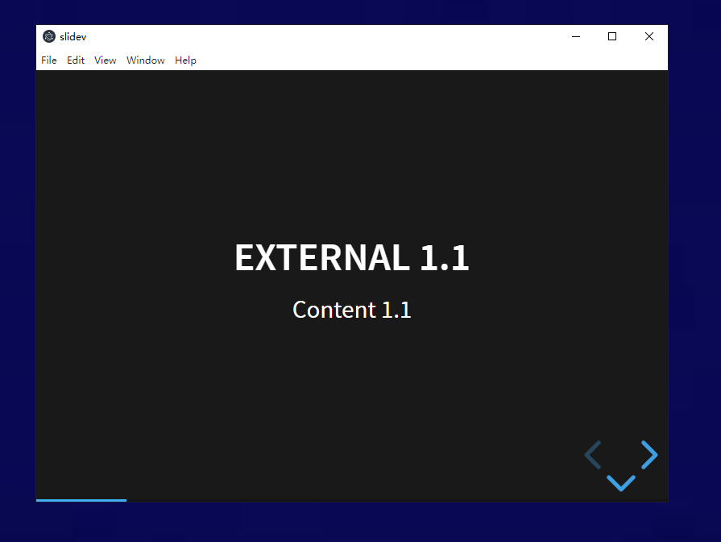

# Slidev

Slidev is a Python wrapper around reveal.js.



## Install

### Run From GitHub With uvx

For a public GitHub repository, you can run the app directly without publishing to PyPI:

```bash
uvx --from git+https://github.com/GZJ/slidev slidev demo.md
```

If you want to pin a branch or tag:

```bash
uvx --from git+https://github.com/GZJ/slidev@master slidev demo.md
```

### Install As A Tool

If you want a persistent `slidev` command on your machine:

```bash
uv tool install --from git+https://github.com/GZJ/slidev slidev
slidev demo.md
```

### Install From Local Checkout

From this repository on your machine:

```bash
uv tool install .
slidev demo.md
```

`uvx slidev` without `--from ...` only works after publishing the package to a Python package index such as PyPI.

## Project layout

- `src/slidev`: Python package and packaged frontend assets
- `frontend`: npm-managed reveal.js dependency and asset sync script

## Development setup

```bash
uv sync
npm --prefix frontend install
npm --prefix frontend run build
```

On Linux, `uv sync` also installs the Qt backend used by `pywebview`.

For GitHub-based installs, the packaged reveal.js assets are already included in the source distribution and wheel, so end users do not need to run npm.

## Run

```bash
uv run slidev demo.md
uv run slidev demo.md --width 1000 --height 1000 --x 0 --y 0
```

If you launch from a remote shell or headless session, pywebview still needs a graphical desktop session to open the window.

For private GitHub repositories, `uvx` and `uv tool install` can still work, but the machine running the command needs Git credentials that can read the repository.

## Updating reveal.js

```bash
npm --prefix frontend install reveal.js@latest
npm --prefix frontend run build
```

The frontend build copies the reveal.js runtime files into `src/slidev/assets/reveal`, and the Python app refreshes its cache automatically when those assets change.
